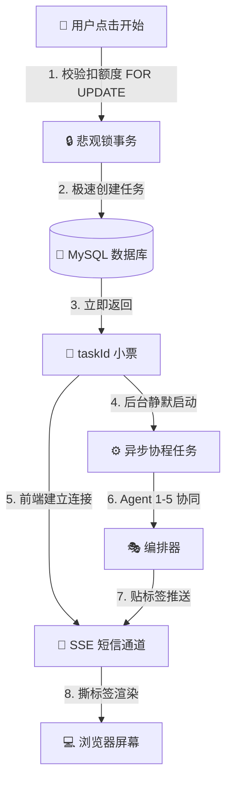

# 📝 AI 爆款文章创作器 —— 阶段学习笔记 (Royi 专属)

恭喜 Royi！我们已经用极简的“小白大白话”和真实源码，彻底攻克了项目最核心的**前半部分（架构与通信主线）**。

下面为你总结我们已经学过的核心模块。建议收藏此页，面试前拿出来读一遍，脑海里立刻就能浮现出画面！

---

## 🚀 已经攻克的四大核心技术模块

### 1. 异步任务主线（异步非阻塞）
*   **生活比喻**：**“餐馆点单排队号”**。复杂的菜（AI 生成）耗时长，服务员不站在厨房死等（同步卡死），而是迅速塞给客人一张小票 `taskId`（异步），让客人去座位上等，服务员立刻接待下一位。
*   **面试价值**：解释了为什么后端能抗住高并发，避免了 HTTP 超时，极大提升了用户体验。

### 2. 商业化配额控制（并发安全）
*   **生活比喻**：**“共享存钱罐挂锁”**。小明和小红同时花最后的 1 元钱。后端拉起“玻璃房（事务）”，小明进去时给 Excel 行挂上“大锁（`SELECT ... FOR UPDATE` 悲观锁）”，小红必须排队。等小明扣完变成 0 元出去了，小红进来被拦截。
*   **面试价值**：展示了你在处理“钱/额度”这种核心商业化资产时，对**高并发数据安全**的严谨设计。

### 3. 双状态机与多智能体协同（断点恢复）
*   **生活比喻**：**“裁缝定制西装”**。
    *   `status`（大状态：制作中/已做好）用于向老板汇报。
    *   `phase`（小阶段：量尺寸/选面料/缝合）用于控制裁缝的步骤。
    *   **Orchestrator（编排器）**：就像车间主管，拿着 `ArticleState`（小本本）记录每一步的数据并存入 MySQL。
*   **面试价值**：解决了 AI 任务长耗时的“不怕断网/停电”（断点恢复），同时防止黑客越权“插队”调用接口。正文与配图的“占位符”设计实现了完美解耦。

### 4. SSE 单通道分类推送（轻量流式）
*   **生活比喻**：**“分类定位短信”**。连接建立后，后端源源不断以 `标签:内容` 的格式（如 `AGENT3_STREAMING:人工智能`）给前端单向发短信。前端（TypeScript）收到后，像拆快递一样把标签“撕掉”，把字精准放进对应的框里。
*   **面试价值**：证明了你没有盲目使用笨重的 WebSocket，而是用最轻量、天然支持流式的 HTML5 标准协议（SSE）解决了大模型流式响应的渲染问题。

---

## 🎯 核心技术数据流向图

---

## 💡 Royi 的面试“装杯”金句卡片（熟读成诵）

> **话术 1（聊高并发）**：
> “因为大模型生成非常慢，我采用了**异步架构**。前端请求创建后，后端在 **50 毫秒内**完成配额校验和落库，立即返回 `taskId`，具体创作过程使用 `asyncio.create_task` 挂在后台跑，利用 **SSE** 把进度实时推给前端。这极大地释放了服务器的线程资源，提高了吞吐量。”

> **话术 2（聊高并发安全）**：
> “为了防止并发抢扣额度，我没有采用简单的写内存锁，而是使用了 **MySQL 悲观锁 `FOR UPDATE` 加事务**。在查询用户额度时直接锁住行，其他并发请求必须排队等待，从根本上杜绝了超卖和资产损失。”

> **话术 3（聊架构解耦）**：
> “在图文合成阶段，我采用了**‘占位符占位 ➔ 异步配图 ➔ 最终正则替换’**的解耦方案。Agent 3 负责写 Markdown 纯文本，Agent 4 负责分析配图并打上 `[image-placeholder-1]` 的占位符，Agent 5 异步去拉图，最后由合成层统一替换。这种设计极其干净，也非常便于扩展。”
