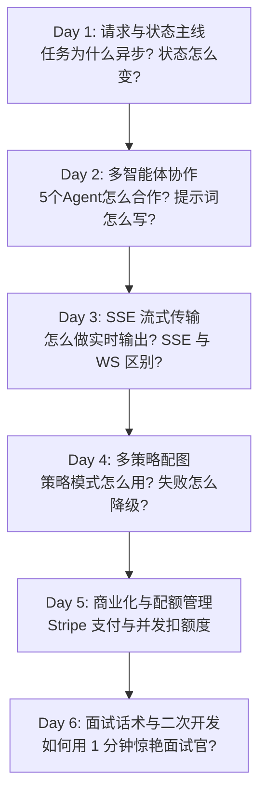

# AI 爆款文章创作器 —— 面试突击学习计划 📚

你好，Royi！这个项目非常适合作为求职面试的实战案例。它包含了**异步任务处理**、**状态机设计**、**大模型多智能体（Multi-Agent）协同**、**SSE流式推送**、**设计模式（策略模式）**以及**商业化支付/并发额度扣减**等后端高频面试考点。

我们将学习过程拆解为 6 个核心模块（主线），每天攻克一个，循序渐进，带你从“小白”蜕变为“能给面试官讲清楚核心架构”的准工程师。

---

## 📅 6天学习路径图

---

## 📝 详细课程大纲

### **Day 1: 请求与状态主线（今天开始）**
*   **核心问题**：用户点击“创建文章”后，后端到底发生了什么？
*   **关键源码**：`app/routers/article.py`, `app/models/article.py`, `app/services/article_service.py`
*   **核心考点**：
    1. 为什么 AI 生成任务要采用**异步**处理？直接同步等待会有什么问题？
    2. 什么是 `status`（整体状态）和 `phase`（具体阶段）？它们是如何在数据库中流转的？
    3. 如果用户刷新了网页，生成过程会不会中断？后端怎么保证进度不丢失？

### **Day 2: 多智能体 (Agent) 协作机制**
*   **核心问题**：为什么不直接用一个大 Prompt 让 AI 写完，而是要拆成 5 个 Agent？
*   **关键源码**：`app/agent/orchestrator.py` 与 `app/agent/agents/` 目录
*   **核心考点**：
    1. 每个 Agent 的职责与 Prompt 设计（标题 -> 大纲 -> 正文 -> 配图分析 -> 配图生成）。
    2. **Orchestrator（编排器）**是如何串联这 5 个 Agent 的？
    3. “人机协同”：如何支持用户在“大纲”和“标题”阶段进行人工修改和确认？

### **Day 3: SSE (Server-Sent Events) 流式推送**
*   **核心问题**：前端如何实时看到 AI “一个字一个字”地蹦出正文？
*   **关键源码**：`app/managers/sse_manager.py`, `app/routers/article.py`
*   **核心考点**：
    1. SSE 是什么？它和 WebSocket、长轮询（Long Polling）有什么区别？
    2. 后端如何利用 `asyncio.Queue` 实现多任务的 SSE 消息分发？
    3. 如果网络断开连接，SSE 怎么处理重连？

### **Day 4: 配图策略模式与容灾降级**
*   **核心问题**：Pexels、Mermaid、表情包、通义千问生图……这么多图片来源，代码怎么写才不乱？
*   **关键源码**：`app/services/image_service_strategy.py` 及各类配图 Service
*   **核心考点**：
    1. 什么是**策略模式（Strategy Pattern）**？在这个项目中是如何实现的？
    2. 如果 Pexels 或阿里云生图接口突然报错/超时，系统怎么做**降级（Fallback）**以保证文章不中断生成？
    3. 腾讯云 COS 上传与大图分发优化。

### **Day 5: 商业化体系（Stripe 支付与配额控制）**
*   **核心问题**：怎么给用户扣点数，怎么收钱？
*   **关键源码**：`app/services/payment_service.py`, `app/routers/payment.py`, `app/services/user_service.py`
*   **核心考点**：
    1. Stripe Webhook 是如何安全接收支付成功回调的？
    2. 并发扣减用户配额时，怎么防止**超卖（Over-consuming）**？（事务与行锁的设计）。
    3. 普通用户和 VIP 用户的权限路由隔离。

### **Day 6: 模拟面试与话术特训**
*   **核心问题**：如何在简历中描写这个项目？怎么回答“这是你独立开发的项目吗”？
*   **核心考点**：
    1. 黄金 1 分钟自述模版。
    2. 针对面试官的经典“挖坑”问题准备标准话术。
    3. 规划一到两个低成本、高回报的“二次开发/补强”方向（如联网搜索开关、从断点重试任务等），作为你的项目亮点。

---

## 💡 我们的学习方式
1. **源码解剖**：我会直接带你看后端对应的 Python 文件，指出最关键的那几行代码。
2. **通俗比喻**：用小白也能听懂的日常案例，解释复杂的设计模式或协议。
3. **情景模拟**：我会扮演面试官突然提问，帮你打磨话术。

如果你准备好了，请点击“接受计划”，我们立刻进入 **Day 1：请求与状态主线** 的学习！
