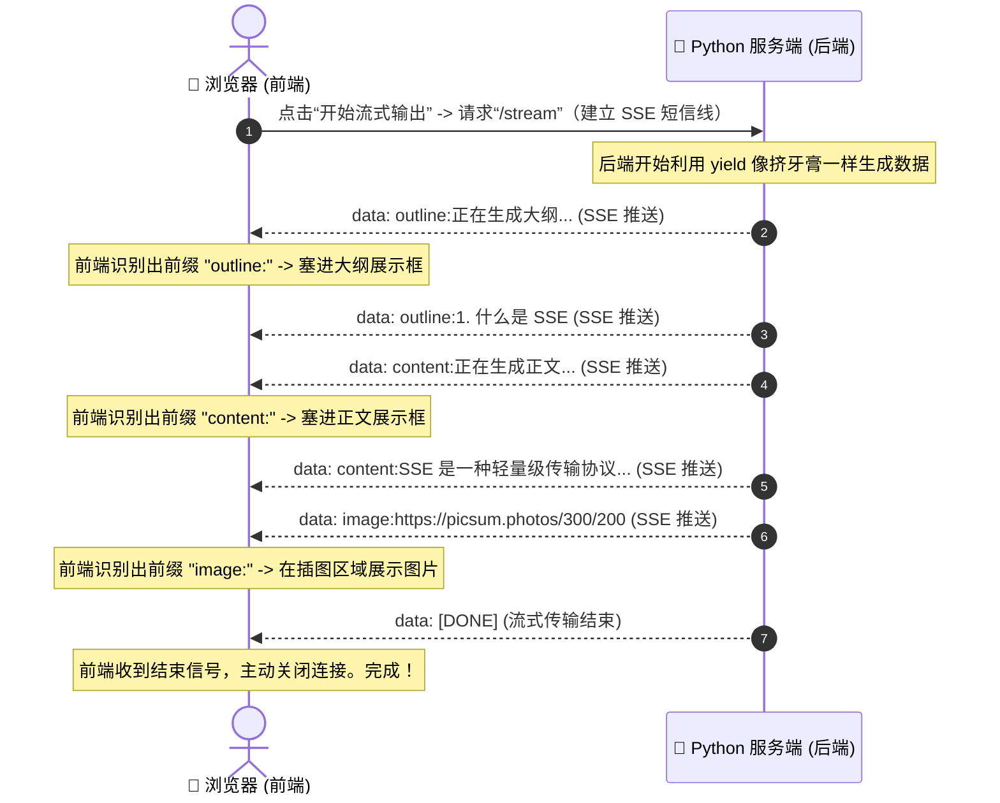

# 计划：SSE 流式输出与前缀标签互动 Demo

你好，Royi！完全理解。让我们把这些抽象的概念变得 **100% 具象、直观且好玩**！

为了让你能够亲身体验并彻底搞懂 **流式输出（Streaming）**、**`yield`（挤牙膏）** 以及 **前缀标签（分类贴标签）** 是如何协同工作的，我设计了一个极简的 **SSE 互动 Demo**。

这个 Demo 只需要运行一个单一的 Python 文件。它 **不需要安装任何额外依赖**（直接使用你项目中已有的 FastAPI），并且会提供一个非常漂亮的网页界面。你可以点击按钮，实时看到：
1. **大纲框** 里的字是如何一个字一个字蹦出来的。
2. **正文框** 里的内容是如何流畅地流式生成的。
3. **AI 插图** 又是如何突然弹出来的！

---

## 🗺️ Demo 的工作原理

这是我们这个小 Demo 的数据流向图：

---

## 🛠️ Demo 的代码设计

我们将在你的工作区里创建一个名为 `sse_nano_demo.py` 的文件，里面包含：

1. **后端 (FastAPI)**：
   - 使用 `yield` 生成器模拟 AI 缓慢吐字的过程。
   - 一个 SSE 路由 `/stream`，用来吐出带有标签的消息，比如 `data: outline:xxx\n\n`、`data: content:xxx\n\n` 等。
   - 一个静态路由 `/`，用来直接向浏览器返回一个漂亮的互动网页。

2. **前端 (HTML + CSS + JS)**：
   - 网页上有三个涂有不同颜色的精致方框：**大纲区域（黄色）**、**正文区域（蓝色）**、**插图区域（绿色）**。
   - 一个“开始流式输出”的按钮。
   - 网页里包含一段最基础的 JS 代码（使用浏览器自带的 `EventSource`），用来监听后端的“短信”，收到短信后，根据冒号前面的标签（如 `outline:` 或 `content:`），自动把文字放到对应的框里。

---

## 📋 接下来我们怎么做？

1. **提交计划**：我已经用中文更新了计划。
2. **编写代码**：当你接受计划后，我将为你编写 `sse_nano_demo.py` 文件。
3. **启动 Demo**：我们用终端命令启动这个小服务。
4. **浏览器体验**：你在浏览器打开 `http://localhost:8000`，点击按钮，亲自体验“挤牙膏”和“前缀标签”的魅力。

你准备好开始了吗？请点击下方的“接受计划”按钮！
